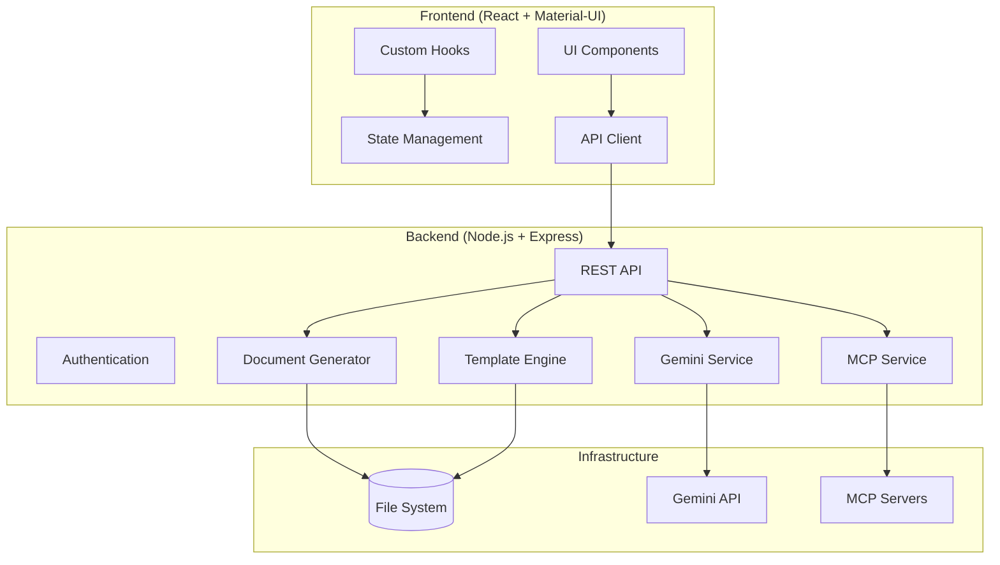
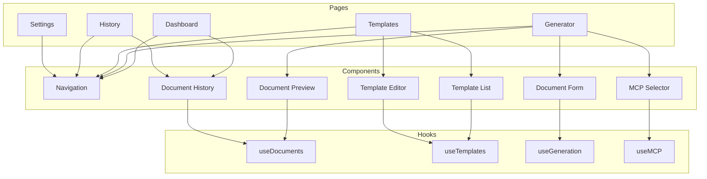
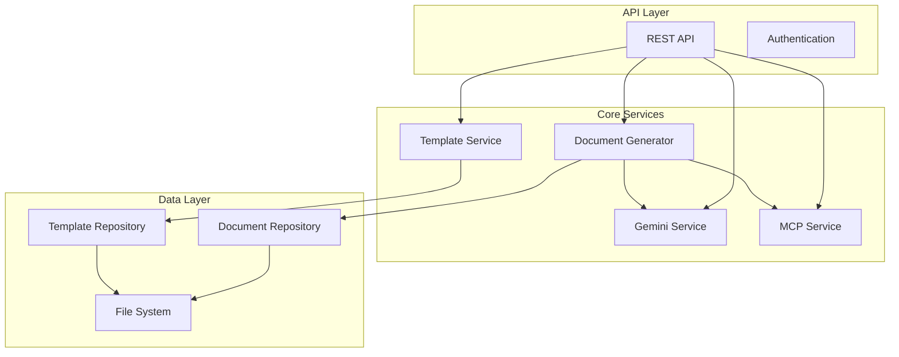
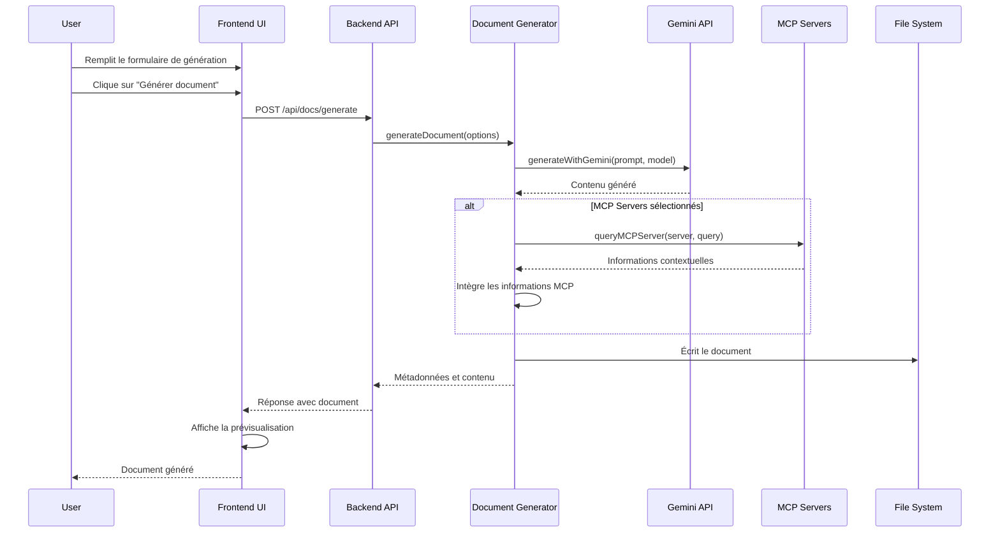
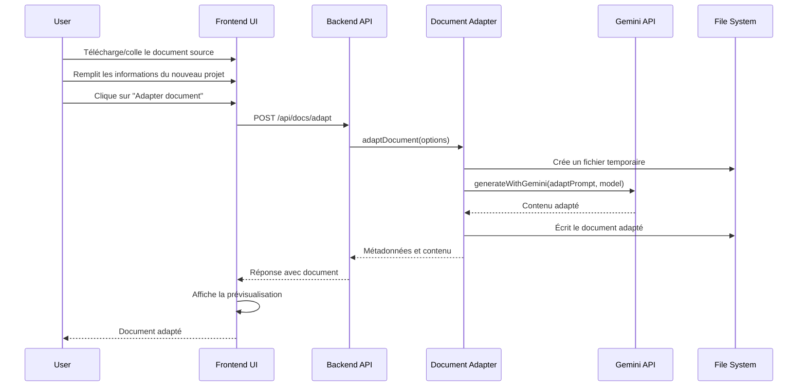
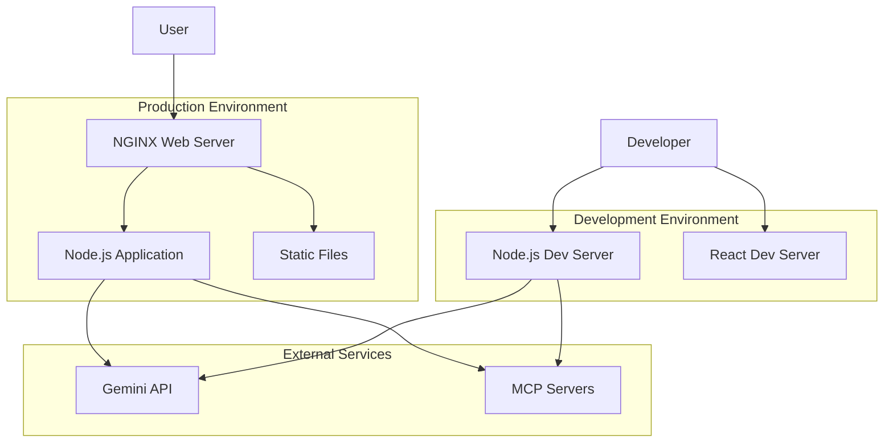

# Design Doc Automator - Design Document

## Overview

Design Doc Automator est une interface web moderne et intuitive pour générer automatiquement des documents de design basés sur le framework PocketFlow et l'API Gemini. Cette plateforme permet aux développeurs et chefs de projet de créer rapidement des documents de conception structurés, d'adapter des documents existants pour de nouveaux projets, et de gérer efficacement leurs templates personnalisés. L'application s'intègre avec l'API Gemini pour une génération intelligente de contenu et supporte les serveurs MCP (Model Context Protocol) pour enrichir les documents avec des informations contextuelles pertinentes.

Ce document de conception décrit l'architecture, les composants, les interfaces et les détails d'implémentation pour Design Doc Automator, en mettant l'accent sur une interface utilisateur moderne avec un design épuré, des transitions fluides, et une intégration complète avec l'API Gemini et les serveurs MCP.

### Fonctionnalités Principales

| Axe | Description | Impact |
|-----|-------------|--------|
| Génération | Création de documents à partir de templates | Documentation standardisée et rapide |
| Adaptation | Transformation de documents existants | Réutilisation efficace du contenu |
| Templates | Gestion de templates personnalisés | Flexibilité et personnalisation |
| IA | Intégration avec l'API Gemini | Contenu intelligent et contextuel |
| MCP | Support des serveurs Model Context Protocol | Enrichissement avec données externes |
| Historique | Gestion des documents générés | Traçabilité et organisation |

## Architecture

### High-Level Architecture

Design Doc Automator suit une architecture d'application web moderne avec une séparation claire des préoccupations :



### Frontend Architecture

Le frontend suit une architecture basée sur les composants utilisant React avec Material-UI :



### Backend Architecture

Le backend est construit sur Node.js avec Express, implémentant les services de génération de documents et d'intégration avec l'API Gemini :



## Components and Interfaces

### Frontend Components

#### 1. Navigation et Layout

Le système de navigation fournit une interface moderne et cohérente dans toute l'application :

```typescript
// Navigation Component
interface NavItem {
  id: string;
  label: string;
  icon: React.ReactNode;
  path: string;
  badge?: number | string;
}

interface NavigationProps {
  items: NavItem[];
  currentPath: string;
  onNavigate: (path: string) => void;
}
```

La mise en page utilise un système de grille responsive avec des transitions fluides entre les vues :

```typescript
// Layout Component
interface LayoutProps {
  sidebar?: React.ReactNode;
  header?: React.ReactNode;
  content: React.ReactNode;
  footer?: React.ReactNode;
  sidebarCollapsed?: boolean;
  onToggleSidebar?: () => void;
}
```

#### 2. Formulaire de Génération de Document

Composants pour configurer et générer des documents de design :

```typescript
// Document Generation Form
interface DocFormProps {
  onSubmit: (data: DocFormData) => Promise<void>;
  templates: Template[];
  models: GeminiModel[];
  mcpServers?: MCPServer[];
  isLoading?: boolean;
  error?: string;
}

interface DocFormData {
  projectName: string;
  description: string;
  features: string[];
  template: string;
  model: string;
  mcpServers?: string[];
  mcpConfig?: Record<string, any>;
}
```

#### 3. Prévisualisation de Document

Composant pour prévisualiser les documents générés avec formatage Markdown :

```typescript
// Document Preview Component
interface DocPreviewProps {
  content: string;
  fileName: string;
  onDownload: () => void;
  onEdit?: () => void;
}
```

#### 4. Gestion des Templates

Composants pour visualiser, éditer et gérer les templates :

```typescript
// Template Editor Component
interface TemplateEditorProps {
  initialContent?: string;
  templateName?: string;
  onSave: (name: string, content: string) => Promise<void>;
  isLoading?: boolean;
  error?: string;
}

// Template List Component
interface TemplateListProps {
  templates: Template[];
  onSelect: (templateId: string) => void;
  onDelete: (templateId: string) => Promise<void>;
  onImport: (file: File) => Promise<void>;
  onExport: (templateId: string) => void;
  isLoading?: boolean;
  error?: string;
}

interface Template {
  id: string;
  name: string;
  description?: string;
  createdAt: string;
  updatedAt: string;
}
```

#### 5. Historique des Documents

Composants pour visualiser et gérer l'historique des documents générés :

```typescript
// Document History Component
interface DocHistoryProps {
  documents: Document[];
  onView: (docId: string) => void;
  onDelete: (docId: string) => Promise<void>;
  onExport: (docId: string) => void;
  onDuplicate: (docId: string) => Promise<void>;
  isLoading?: boolean;
  error?: string;
}

interface Document {
  id: string;
  projectName: string;
  description: string;
  template: string;
  model: string;
  createdAt: string;
  filePath: string;
  isAdapted?: boolean;
}
```

### Backend Components

#### 1. API Controllers

```javascript
// Document Controller
exports.generateDoc = async (req, res) => {
  // Validation des paramètres
  // Appel au service de génération
  // Gestion des erreurs
  // Réponse avec le document généré
};

exports.adaptDoc = async (req, res) => {
  // Validation des paramètres
  // Appel au service d'adaptation
  // Gestion des erreurs
  // Réponse avec le document adapté
};

exports.getAllDocs = async (req, res) => {
  // Récupération des documents
  // Tri et filtrage
  // Réponse avec la liste des documents
};

exports.getDocById = async (req, res) => {
  // Récupération du document par ID
  // Lecture du contenu
  // Réponse avec le document et son contenu
};

exports.deleteDoc = async (req, res) => {
  // Suppression du document
  // Suppression du fichier associé
  // Réponse avec confirmation
};

// Template Controller
exports.getAllTemplates = async (req, res) => {
  // Récupération des templates
  // Réponse avec la liste des templates
};

exports.getTemplateById = async (req, res) => {
  // Récupération du template par ID
  // Lecture du contenu
  // Réponse avec le template et son contenu
};

exports.createTemplate = async (req, res) => {
  // Validation des paramètres
  // Création du template
  // Réponse avec le template créé
};

exports.updateTemplate = async (req, res) => {
  // Validation des paramètres
  // Mise à jour du template
  // Réponse avec le template mis à jour
};

exports.deleteTemplate = async (req, res) => {
  // Suppression du template
  // Réponse avec confirmation
};

exports.importTemplate = async (req, res) => {
  // Validation du fichier importé
  // Création du template
  // Réponse avec le template importé
};

exports.exportTemplate = async (req, res) => {
  // Récupération du template
  // Génération du fichier d'export
  // Réponse avec le fichier
};
```

#### 2. Services

```javascript
// Generator Service
exports.generateDocument = async (options) => {
  // Chargement de la configuration
  // Préparation des paramètres
  // Appel à l'API Gemini
  // Post-traitement du contenu généré
  // Sauvegarde du document
  // Retour du résultat
};

exports.adaptDocument = async (options) => {
  // Chargement de la configuration
  // Préparation des paramètres
  // Création d'un fichier temporaire pour le contenu exemple
  // Appel à l'API Gemini pour l'adaptation
  // Post-traitement du contenu adapté
  // Sauvegarde du document
  // Retour du résultat
};

// Template Service
exports.getTemplates = async () => {
  // Lecture du répertoire des templates
  // Filtrage des fichiers
  // Extraction des métadonnées
  // Retour de la liste des templates
};

exports.getTemplateContent = async (templateName) => {
  // Vérification de l'existence du template
  // Lecture du contenu
  // Retour du contenu
};

exports.createTemplate = async (name, content) => {
  // Validation du nom et du contenu
  // Création du fichier template
  // Retour des métadonnées du template
};

exports.updateTemplate = async (name, content) => {
  // Vérification de l'existence du template
  // Mise à jour du contenu
  // Retour des métadonnées du template
};

exports.deleteTemplate = async (name) => {
  // Vérification de l'existence du template
  // Suppression du fichier
  // Retour de confirmation
};
```

#### 3. Intégration avec l'API Gemini

```javascript
// Gemini Service
const { GoogleGenerativeAI } = require('@google/generative-ai');

exports.generateWithGemini = async (prompt, model, options = {}) => {
  // Initialisation du client Gemini
  const genAI = new GoogleGenerativeAI(process.env.GEMINI_API_KEY);
  
  // Sélection du modèle
  const geminiModel = genAI.getGenerativeModel({ model });
  
  // Configuration des paramètres de génération
  const generationConfig = {
    temperature: options.temperature || 0.7,
    topK: options.topK || 40,
    topP: options.topP || 0.95,
    maxOutputTokens: options.maxTokens || 8192,
  };
  
  // Génération du contenu
  const result = await geminiModel.generateContent({
    contents: [{ role: 'user', parts: [{ text: prompt }] }],
    generationConfig,
  });
  
  // Extraction et retour du texte généré
  return result.response.text();
};
```

#### 4. Intégration avec les serveurs MCP

```javascript
// MCP Service
exports.getMCPServers = async () => {
  // Récupération de la liste des serveurs MCP disponibles
  // Retour de la liste avec leurs capacités
};

exports.queryMCPServer = async (serverName, query, options = {}) => {
  // Validation du serveur et de la requête
  // Préparation des paramètres
  // Appel au serveur MCP
  // Traitement de la réponse
  // Retour du résultat
};
```

## User Interface Design

### Dashboard

Le dashboard présente une vue d'ensemble des activités récentes et des statistiques :

```
+---------------------------------------------------------------+
|  Design Doc Automator                              User Menu   |
+---------------------------------------------------------------+
|        |                                                      |
| N      | Activité récente                                     |
| A      |                                                      |
| V      | +-------------------+  +-------------------+         |
| I      | | Documents récents |  | Templates utilisés |        |
| G      | | - SmartInventory  |  | - PocketFlow: 65%  |        |
| A      | | - TaskFlow        |  | - Basic: 20%       |        |
| T      | | - DataAnalyzer    |  | - Custom: 15%      |        |
| I      | +-------------------+  +-------------------+         |
| O      |                                                      |
| N      | +-------------------+  +-------------------+         |
|        | | Modèles Gemini    |  | Actions rapides    |        |
|        | | - gemini-2.5-pro  |  | [Nouveau document] |        |
|        | | - gemini-2.5-flash|  | [Gérer templates]  |        |
|        | +-------------------+  +-------------------+         |
+---------------------------------------------------------------+
```

### Générateur de Document

L'interface de génération de document permet de configurer et prévisualiser les documents :

```
+---------------------------------------------------------------+
|  Design Doc Automator > Générateur            User Menu       |
+---------------------------------------------------------------+
|        |                                                      |
| N      | [Nouveau document] [Adapter document]                |
| A      |                                                      |
| V      | +-------------------+  +-------------------+         |
| I      | | Configuration     |  | Prévisualisation  |         |
| G      | |                   |  |                   |         |
| A      | | Nom du projet:    |  | # Project Name    |         |
| T      | | [____________]    |  |                   |         |
| I      | |                   |  | ## Objectifs      |         |
| O      | | Description:      |  | Description...    |         |
| N      | | [____________]    |  |                   |         |
|        | |                   |  | ## Fonctionnalités|         |
|        | | Fonctionnalités:  |  | - Feature 1       |         |
|        | | [____________]    |  | - Feature 2       |         |
|        | | [+ Ajouter]       |  |                   |         |
|        | |                   |  |                   |         |
|        | | Template:         |  |                   |         |
|        | | [PocketFlow    v] |  |                   |         |
|        | |                   |  |                   |         |
|        | | Modèle Gemini:    |  |                   |         |
|        | | [gemini-2.5-pro v]|  |                   |         |
|        | |                   |  |                   |         |
|        | | MCP Servers:      |  |                   |         |
|        | | [x] PocketFlow    |  |                   |         |
|        | | [ ] Context7      |  |                   |         |
|        | | [ ] Archon        |  |                   |         |
|        | |                   |  |                   |         |
|        | | [Générer document]|  | [Télécharger]     |         |
|        | +-------------------+  +-------------------+         |
+---------------------------------------------------------------+
```

### Gestionnaire de Templates

L'interface de gestion des templates permet de créer, éditer et gérer les templates :

```
+---------------------------------------------------------------+
|  Design Doc Automator > Templates              User Menu      |
+---------------------------------------------------------------+
|        |                                                      |
| N      | [Nouveau template] [Importer]                        |
| A      |                                                      |
| V      | +-------------------+  +-------------------+         |
| I      | | Templates         |  | Éditeur           |         |
| G      | |                   |  |                   |         |
| A      | | - PocketFlow      |  | # ${projectName}  |         |
| T      | | - Basic           |  |                   |         |
| I      | | - Custom          |  | ## Objectifs      |         |
| O      | |                   |  | ${description}    |         |
| N      | |                   |  |                   |         |
|        | |                   |  | ## Fonctionnalités|         |
|        | |                   |  | ${features.map(f =>|         |
|        | |                   |  |   `- ${f}`        |         |
|        | |                   |  | ).join('\n')}     |         |
|        | |                   |  |                   |         |
|        | |                   |  |                   |         |
|        | |                   |  |                   |         |
|        | |                   |  |                   |         |
|        | |                   |  |                   |         |
|        | |                   |  |                   |         |
|        | |                   |  |                   |         |
|        | |                   |  | [Sauvegarder]     |         |
|        | +-------------------+  +-------------------+         |
+---------------------------------------------------------------+
```

### Historique des Documents

L'interface d'historique permet de consulter et gérer les documents générés :

```
+---------------------------------------------------------------+
|  Design Doc Automator > Historique            User Menu       |
+---------------------------------------------------------------+
|        |                                                      |
| N      | Recherche: [____________]  Trier par: [Date    v]    |
| A      |                                                      |
| V      | +---------------------------------------------------+|
| I      | | Nom           | Template  | Date       | Actions  ||
| G      | |---------------|-----------|------------|----------||
| A      | | SmartInventory| PocketFlow| 2025-07-21 | [⋮]      ||
| T      | | TaskFlow      | PocketFlow| 2025-07-19 | [⋮]      ||
| I      | | DataAnalyzer  | Basic     | 2025-07-15 | [⋮]      ||
| O      | | UserPortal    | Custom    | 2025-07-10 | [⋮]      ||
| N      | |               |           |            |          ||
|        | |               |           |            |          ||
|        | |               |           |            |          ||
|        | |               |           |            |          ||
|        | +---------------------------------------------------+|
|        |                                                      |
|        | Actions: [Voir] [Télécharger] [Dupliquer] [Supprimer]|
+---------------------------------------------------------------+
```

## Data Flow

### Génération de Document



### Adaptation de Document



## Déploiement et Configuration

### Configuration de l'Application

L'application utilise des variables d'environnement pour la configuration :

#### Backend (.env)
```
PORT=3001
GEMINI_API_KEY=votre_clé_api_gemini
TEMPLATES_DIR=../templates
OUTPUT_DIR=../output
```

#### Frontend (.env)
```
REACT_APP_API_URL=http://localhost:3001/api
```

### Architecture de Déploiement



## Considérations Techniques

### Sécurité

1. **Validation des entrées** : Toutes les entrées utilisateur sont validées et sanitisées.
2. **Protection des API keys** : Les clés API sont stockées dans des variables d'environnement.
3. **HTTPS** : Toutes les communications externes utilisent HTTPS.
4. **Validation des fichiers** : Les fichiers téléchargés sont validés pour leur type et leur taille.

### Performance

1. **Optimisation des requêtes Gemini** : Les prompts sont optimisés pour réduire l'utilisation de tokens.
2. **Mise en cache** : Les templates et documents fréquemment utilisés sont mis en cache.
3. **Chargement paresseux** : Les composants UI sont chargés à la demande.
4. **Pagination** : Les listes longues sont paginées pour améliorer les performances.

### Extensibilité

1. **Architecture modulaire** : Les composants sont conçus pour être facilement étendus.
2. **API bien documentée** : Les interfaces API sont clairement documentées.
3. **Hooks personnalisés** : Des hooks React personnalisés facilitent l'extension des fonctionnalités.
4. **Support de plugins** : L'architecture permet l'ajout de plugins pour de nouvelles fonctionnalités.

Le design met l'accent sur une interface utilisateur moderne avec un design épuré et des transitions fluides, tout en fournissant des outils complets pour la génération de documents, la gestion de templates, et l'intégration avec l'API Gemini et les serveurs MCP. L'architecture modulaire assure l'extensibilité et la maintenabilité, tandis que la configuration de déploiement prend en charge une installation facile dans différents environnements.
