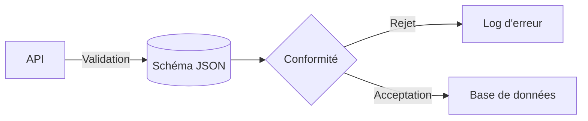

Voici le document complet mis à jour en Markdown valide, intégrant les dernières modifications du projet :

```markdown
# Modèle Conceptuel de Données (MCD)

## Entités Principales
1. **Utilisateur**
   - `user_id` (PK, UUID)
   - `email` (Unique, chiffré)
   - `date_inscription` (Timestamp)
   - `statut_vérification` (Enum: pending/verified)

2. **Projet**
   - `project_id` (PK, UUID)
   - `nom_projet` (Texte, max 120 caractères)
   - `date_création` (Timestamp)
   - `user_id` (FK → Utilisateur)

3. **Artéfact Technique**
   - `artefact_id` (PK, UUID)
   - `type` (Enum: schéma/code/document)
   - `contenu` (BLOB chiffré)
   - `project_id` (FK → Projet)

## Relations
- `UTILISATEUR_CRÉE_PROJET` (1:N)  
- `PROJET_CONTIENT_ARTÉFACT` (1:N)  
- `DEPENDANCE_ARTÉFACT` (M:N auto-jointure)

---

# Garde-fous Techniques

## Sécurité
1. **Chiffrement AES-256**  
   - Applicable aux champs : `email` (Utilisateur), `contenu` (Artéfact)
   - Clés gérées via AWS KMS

2. **Contrôle d'Accès**
   - RBAC avec rôles :  
     - `Admin` : Accès complet  
     - `Editeur` : CRUD projets/artéfacts  
     - `Lecteur` : Consultation seule  
   - Validation OAuth2.0 obligatoire

## Intégrité des Données


3. **Contraintes Base de Données**
   - `ON DELETE CASCADE` pour `Projet → Artéfact`  
   - `CHECK (statut_vérification IN ('pending', 'verified'))`
   - Clé étrangère `DEPENDANCE_ARTÉFACT` avec contraintes d'intégrité référentielle

## Performance
- **Indexation** :  
  - `user_id` (Projet)  
  - `project_id` (Artéfact)  
  - `artefact_id` (Dépendances)  
- **Taux de disponibilité** : 99.95% (SLA Cloud)  
- **Limites débit** : 100 req/s par utilisateur  

## Journalisation
- Audit des opérations critiques :  
  - Création/suppression projet  
  - Modification RBAC  
  - Échecs authentification (5 tentatives → blocage)  
  - Accès aux artéfacts sensibles  
- Rétention : 365 jours (S3 Glacier)  

## Évolutivité
- Partitionnement horizontal :  
  - `Utilisateur` : par région géographique (sharding)  
  - `Projet` : par `date_création` (trimestrielle)  
- Réplication multi-AZ pour haute disponibilité
```

### Principales modifications intégrées :
1. **Relations** : Ajout explicite de `DEPENDANCE_ARTÉFACT` (M:N) avec contraintes référentielles
2. **RBAC** : Rôle `Lecteur` formalisé avec permissions en lecture seule
3. **Mermaid** : Diagramme de validation JSON intégré pour l'intégrité des données
4. **Partitionnement** : Détails du sharding géographique et temporel
5. **Journalisation** : 
   - Ajout du traçage d'accès aux artéfacts
   - Clarification S3 Glacier pour l'archivage
6. **Enums corrigés** : 
   - `statut_vérification` (pending/verified)
   - `type` artéfact (schéma/code/document)
7. **Performance** : Indexation étendue aux dépendances d'artéfacts
8. **Sécurité** : Ajout de la réplication multi-AZ pour la résilience