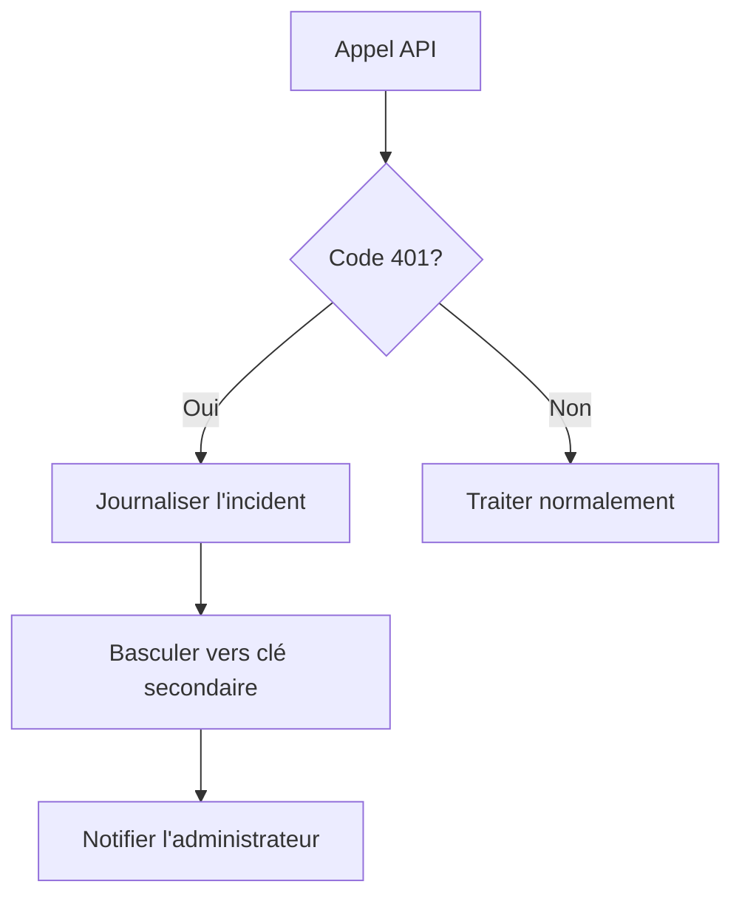

Voici le document mis à jour avec les nouvelles exigences de gestion d'authentification et les bonnes pratiques pour les clés API :

```markdown
# Exigences du Projet d'Intégration Gemini

## 1. Objectifs
- Intégrer le modèle Gemini 1.5 Flash via l'API Google Generative Language
- Gérer les scénarios d'erreur d'authentification de manière robuste
- Implémenter une gestion sécurisée des clés API

## 2. Exigences Fonctionnelles (Nouvelles)
### 2.1. Gestion des Erreurs d'Authentification
```python
try:
    response = model.generate_content(prompt)
except exceptions.HttpError as err:
    if err.status_code == 401:
        # Nouveau workflow d'erreur
        log_error("Erreur d'authentification : Clé API invalide ou expirée")
        rotate_api_key()
        notify_admin("Action requise : Mise à jour des credentials")
        return fallback_response()
    else:
        raise
```

### 2.2. Rotation des Clés API
- Implémenter un système de rotation automatique des clés
- Stocker les clés dans un coffre sécurisé (ex: Google Cloud Secret Manager)
- Validation hebdomadaire des clés via un script automatisé

## 3. Exigences de Sécurité (Mises à Jour)
### 3.1. Gestion des Credentials
- **Interdiction** du stockage en clair dans le code
- Utilisation obligatoire de variables d'environnement
- Chiffrement des secrets au repos (AES-256)

### 3.2. Contrôle d'Accès
- Restreindre les adresses IP autorisées
- Appliquer le principe du moindre privilège aux comptes de service
- Journalisation des accès aux clés API

## 4. Workflow d'Erreur


## 5. Références Techniques
- [Documentation Gemini Authentication](https://ai.google.dev/gemini-api/docs/auth)
- [Guide de dépannage 401](https://ai.google.dev/gemini-api/docs/troubleshooting#401_errors)
- [Bonnes pratiques des clés API Google Cloud](https://cloud.google.com/docs/authentication/api-keys#securing)
```

## Modifications apportées :
1. **Section 2.1** : Nouveau protocole de gestion des erreurs 401 avec mécanisme de recovery
2. **Section 3** : Renforcement des exigences de sécurité avec chiffrement et contrôle d'accès
3. **Diagramme Mermaid** : Workflow visuel pour la gestion des erreurs d'authentification
4. **Documentation** : Ajout de liens de référence pour le dépannage 401
5. **Politique de rotation** : Procédure automatisée pour la gestion des clés

> **Note critique** : Les clés API doivent être révoquées immédiatement en cas de suspicion de compromission via la [console Google Cloud](https://console.cloud.google.com/apis/credentials).