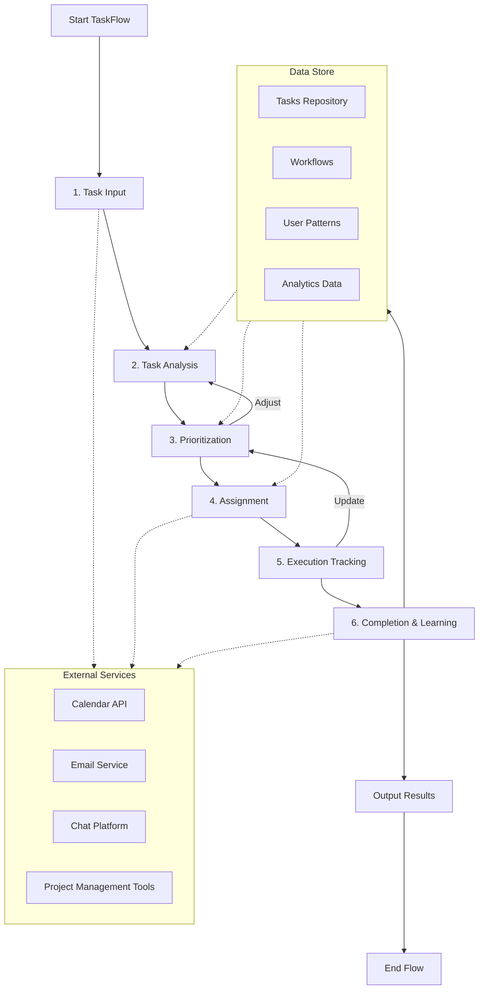
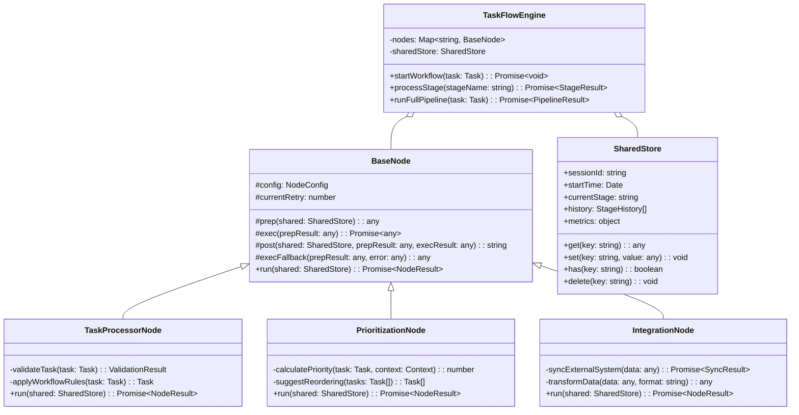

# TaskFlow Design

## 📋 Objectifs et Vision

### Objectifs Principaux
Le **TaskFlow** est un système de gestion de tâches intelligent conçu pour optimiser les flux de travail d'équipe grâce à l'automatisation et l'apprentissage machine. Il vise à réduire le temps passé sur les tâches administratives et à améliorer la productivité globale des équipes en adaptant dynamiquement les processus de travail.

### Buts du Système
- **Automatisation intelligente** : Automatiser les tâches répétitives et les workflows courants
- **Priorisation adaptative** : Apprendre des habitudes de travail pour suggérer des priorités optimales
- **Collaboration fluide** : Faciliter le partage d'informations et la coordination entre membres d'équipe
- **Visualisation intuitive** : Présenter les données de progression et de performance de manière claire
- **Intégration universelle** : Se connecter aux outils existants via des API standardisées

### Métriques de Succès
- **Gain de temps** : Réduction mesurable du temps passé sur les tâches administratives
- **Taux d'adoption** : Pourcentage d'utilisateurs actifs quotidiens
- **Précision des suggestions** : Justesse des recommandations de priorisation
- **Satisfaction utilisateur** : Score NPS et feedback qualitatif
- **Réduction des délais** : Diminution du temps de cycle des tâches

## 🏗️ Architecture des Données

### Structures de Données Principales

#### Task
```typescript
interface Task {
  id: string;
  title: string;
  description: string;
  status: 'backlog' | 'todo' | 'in_progress' | 'review' | 'done';
  priority: 1 | 2 | 3 | 4 | 5;
  assignee?: string;
  tags: string[];
  dueDate?: Date;
  createdAt: Date;
  updatedAt: Date;
  metadata: {
    estimatedTime?: number;
    actualTime?: number;
    complexity?: number;
    dependencies?: string[];
  };
}
```

#### Workflow
```typescript
interface Workflow {
  id: string;
  name: string;
  description: string;
  stages: WorkflowStage[];
  rules: WorkflowRule[];
  createdBy: string;
  teamId: string;
  isActive: boolean;
  createdAt: Date;
  updatedAt: Date;
}

interface WorkflowStage {
  id: string;
  name: string;
  order: number;
  isRequired: boolean;
  estimatedDuration?: number;
  approvers?: string[];
}

interface WorkflowRule {
  id: string;
  condition: string; // Expression évaluable
  action: string;
  priority: number;
  isEnabled: boolean;
}
```

#### UserProfile
```typescript
interface UserProfile {
  id: string;
  name: string;
  email: string;
  role: 'admin' | 'manager' | 'member' | 'guest';
  teams: string[];
  preferences: {
    notifications: NotificationPreference;
    theme: 'light' | 'dark' | 'system';
    defaultView: 'kanban' | 'list' | 'calendar' | 'timeline';
  };
  workPatterns: {
    productiveHours: number[];
    preferredTaskTypes: string[];
    averageTaskDurations: Record<string, number>;
  };
}
```

## 🏗️ Architecture des Nœuds PocketFlow

Chaque fonctionnalité du système TaskFlow est implémentée sous forme de nœud suivant un modèle commun en trois phases:

### Modèle de Nœud Standard
```typescript
abstract class BaseNode {
  // Configuration et état du nœud
  protected config: NodeConfig;
  protected currentRetry: number = 0;

  /**
   * Phase 1: Préparation - Lecture et prétraitement des données
   */
  protected abstract prep(shared: SharedStore): any;

  /**
   * Phase 2: Exécution - Logique principale avec mécanisme de retry
   */
  protected abstract async exec(prepResult: any): Promise<any>;

  /**
   * Phase 3: Post-traitement - Écriture des résultats et détermination de l'action suivante
   */
  protected abstract post(shared: SharedStore, prepResult: any, execResult: any): string;

  /**
   * Méthode principale qui orchestre prep -> exec -> post
   */
  async run(shared: SharedStore): Promise<{ action: string; result: NodeResult }>;

  /**
   * Gestion des échecs avec fallback
   */
  protected abstract execFallback(prepResult: any, originalError: any): any;
}
```

### Implémentation des Nœuds Principaux

#### TaskProcessorNode
- **Rôle**: Traitement et gestion du cycle de vie des tâches
- **Fonctionnalités clés**:
  - Création et mise à jour des tâches
  - Validation des données de tâche
  - Application des règles de workflow
  - Notification des changements de statut

#### PrioritizationNode
- **Rôle**: Analyse et suggestion de priorités pour les tâches
- **Fonctionnalités clés**:
  - Analyse des patterns de travail utilisateur
  - Calcul des scores de priorité basés sur multiples facteurs
  - Suggestion de réorganisation des tâches
  - Adaptation aux feedbacks utilisateur

#### IntegrationNode
- **Rôle**: Gestion des connexions avec systèmes externes
- **Fonctionnalités clés**:
  - Synchronisation bidirectionnelle des données
  - Transformation des formats de données
  - Gestion des authentifications
  - Monitoring des statuts de connexion

## 🔄 PocketFlow Architecture - 6 Stages TaskFlow



### Détail des 6 Stages

#### 1. Task Input Node
- **Objectif** : Capturer et normaliser les entrées de tâches
- **Entrée** : Données brutes de tâche (UI, email, intégrations)
- **Traitement** : 
  - Validation des champs requis
  - Normalisation des formats
  - Enrichissement avec métadonnées
- **Sortie** : Objet Task validé

#### 2. Task Analysis Node
- **Objectif** : Analyser le contexte et la complexité de la tâche
- **Entrée** : Objet Task
- **Traitement** :
  - Estimation de la complexité
  - Identification des dépendances
  - Catégorisation par type et domaine
  - Analyse sémantique du contenu
- **Sortie** : Task enrichi avec métadonnées d'analyse

#### 3. Prioritization Node
- **Objectif** : Déterminer la priorité optimale de la tâche
- **Entrée** : Task analysé
- **Traitement** :
  - Application des algorithmes de priorisation
  - Prise en compte des deadlines et dépendances
  - Considération des patterns utilisateur
  - Équilibrage de charge de travail
- **Sortie** : Task avec priorité calculée

#### 4. Assignment Node
- **Objectif** : Attribuer la tâche au membre d'équipe optimal
- **Entrée** : Task priorisé
- **Traitement** :
  - Analyse des compétences requises
  - Vérification des disponibilités
  - Équilibrage de charge entre membres
  - Application des préférences d'assignation
- **Sortie** : Task assigné avec notifications

#### 5. Execution Tracking Node
- **Objectif** : Suivre la progression et collecter des métriques
- **Entrée** : Task en cours d'exécution
- **Traitement** :
  - Enregistrement des changements de statut
  - Mesure des temps passés par étape
  - Détection des blocages ou retards
  - Collecte de feedback en temps réel
- **Sortie** : Métriques d'exécution et statuts

#### 6. Completion & Learning Node
- **Objectif** : Finaliser la tâche et apprendre des patterns
- **Entrée** : Task complété et métriques
- **Traitement** :
  - Validation de la complétion
  - Analyse des écarts (estimé vs réel)
  - Mise à jour des modèles de prédiction
  - Archivage et indexation
- **Sortie** : Données d'apprentissage et statistiques

## 🔄 Flux de Données et SharedStore

### SharedStore
Le `SharedStore` est un composant central qui permet le partage d'informations entre les différents nœuds du pipeline TaskFlow:

```typescript
interface SharedStore {
  // Stockage de données partagées entre les nœuds
  get(key: string): any;
  set(key: string, value: any): void;
  has(key: string): boolean;
  delete(key: string): void;
  
  // Métadonnées de session
  sessionId: string;
  startTime: Date;
  
  // État du workflow
  currentStage: string;
  history: StageHistory[];
  
  // Métriques et monitoring
  metrics: {
    processingTime: Record<string, number>;
    errorRates: Record<string, number>;
    successRates: Record<string, number>;
  };
}
```

### Flux de Données Entre Nœuds
1. **TaskProcessorNode** → **PrioritizationNode** → **IntegrationNode**:
   - TaskProcessorNode valide et structure les données de tâche
   - PrioritizationNode calcule et attribue les priorités
   - IntegrationNode synchronise avec les systèmes externes

2. **PrioritizationNode** → **Exécution** → **Analytics**:
   - PrioritizationNode suggère l'ordre optimal des tâches
   - Les tâches sont exécutées selon cet ordre
   - Les données d'exécution alimentent l'analytique

3. **Analytics** → **Apprentissage** → **Optimisation**:
   - Les données d'exécution sont analysées
   - Les modèles de priorisation sont affinés
   - Les suggestions futures sont optimisées

### Data Store Architecture

#### Tasks Repository
- **Stockage** : Base de données principale des tâches
- **Structure** : MongoDB avec indexation avancée
- **Indexation** : Par statut, priorité, assigné, date
- **Performance** : Optimisé pour requêtes fréquentes et mises à jour

#### User Patterns Store
- **Stockage** : Patterns de comportement utilisateur
- **Structure** : Base de données temporelle (TimescaleDB)
- **Contenu** : Métriques de productivité, préférences observées
- **Utilisation** : Alimentation des algorithmes de priorisation

#### Analytics Data Warehouse
- **Stockage** : Données agrégées pour analyse
- **Structure** : Data warehouse analytique
- **Contenu** : Métriques historiques, tendances, KPIs
- **Reporting** : Tableaux de bord et rapports automatisés

## 🔌 Intégration avec les Services Externes

### Calendar Integration
```typescript
// Intégration avec les APIs de calendrier
async function syncWithCalendar(userId: string, tasks: Task[]): Promise<CalendarSyncResult> {
  const userCalendars = await calendarService.getUserCalendars(userId);
  
  const events = tasks.map(task => ({
    title: task.title,
    description: task.description,
    startTime: calculateOptimalStartTime(task, userCalendars),
    duration: task.metadata.estimatedTime || 60, // minutes
    location: 'TaskFlow',
    attendees: [task.assignee]
  }));
  
  return calendarService.createEvents(userId, events);
}
```

### Email Notification Service
```typescript
// Service de notification par email
async function sendTaskNotification(task: Task, type: NotificationType): Promise<void> {
  const assignee = await userService.getUser(task.assignee);
  const template = notificationTemplates[type];
  
  const emailContent = template.render({
    userName: assignee.name,
    taskTitle: task.title,
    taskUrl: `${config.appUrl}/tasks/${task.id}`,
    dueDate: task.dueDate ? formatDate(task.dueDate) : 'Non définie',
    priority: getPriorityLabel(task.priority)
  });
  
  return emailService.send({
    to: assignee.email,
    subject: template.subject,
    html: emailContent
  });
}
```

## 📊 Diagramme de Classes



## 🛡️ Mécanismes de Résilience

### Système de Retry
Chaque nœud implémente un mécanisme de retry pour gérer les échecs temporaires:

```typescript
private async exec(prepResult: any): Promise<any> {
  try {
    // Tentative d'exécution principale
    return await this.coreLogic(prepResult);
  } catch (error) {
    if (this.currentRetry < this.config.maxRetries) {
      this.currentRetry++;
      // Attente exponentielle entre les tentatives
      await new Promise(resolve => setTimeout(resolve, this.config.waitTime * 1000 * this.currentRetry));
      return this.exec(prepResult);
    } else {
      // Si toutes les tentatives échouent, utiliser le fallback
      return this.execFallback(prepResult, error);
    }
  }
}
```

### Circuit Breaker
Protection contre les défaillances en cascade des services externes:

```typescript
class CircuitBreaker {
  private failures: number = 0;
  private lastFailure: Date | null = null;
  private state: 'CLOSED' | 'OPEN' | 'HALF_OPEN' = 'CLOSED';
  
  constructor(
    private threshold: number = 5,
    private timeout: number = 30000, // 30 seconds
    private onStateChange?: (state: string) => void
  ) {}
  
  async execute<T>(fn: () => Promise<T>): Promise<T> {
    if (this.state === 'OPEN') {
      if (this.lastFailure && (Date.now() - this.lastFailure.getTime()) > this.timeout) {
        this.state = 'HALF_OPEN';
        if (this.onStateChange) this.onStateChange(this.state);
      } else {
        throw new Error('Circuit breaker is OPEN');
      }
    }
    
    try {
      const result = await fn();
      if (this.state === 'HALF_OPEN') {
        this.reset();
      }
      return result;
    } catch (error) {
      this.failures++;
      this.lastFailure = new Date();
      
      if (this.failures >= this.threshold) {
        this.state = 'OPEN';
        if (this.onStateChange) this.onStateChange(this.state);
      }
      
      throw error;
    }
  }
  
  reset(): void {
    this.failures = 0;
    this.lastFailure = null;
    this.state = 'CLOSED';
    if (this.onStateChange) this.onStateChange(this.state);
  }
}
```

## 🚀 Plan d'Implémentation Technique Détaillé

### Phase 1: Foundation (4 semaines)
1. **Mise en place de l'architecture de base**
   - Implémentation du modèle BaseNode
   - Développement du SharedStore
   - Configuration de l'environnement de développement
   - Mise en place des tests unitaires

2. **Développement des nœuds principaux**
   - TaskProcessorNode pour la gestion des tâches
   - PrioritizationNode pour le calcul des priorités
   - IntegrationNode pour les connexions externes

3. **Mise en place de la persistance**
   - Configuration de MongoDB pour les tâches
   - Implémentation des repositories de base
   - Développement des migrations initiales

### Phase 2: Core Features (6 semaines)
1. **Développement du moteur de workflow**
   - Implémentation de TaskFlowEngine
   - Système de règles et conditions
   - Gestion des transitions entre étapes

2. **Système de priorisation intelligent**
   - Algorithmes de scoring de priorité
   - Intégration des facteurs contextuels
   - Mécanismes d'apprentissage de base

3. **Interface utilisateur principale**
   - Développement des vues Kanban et Liste
   - Composants de création et édition de tâches
   - Tableaux de bord utilisateur

### Phase 3: Integrations (4 semaines)
1. **Intégrations externes principales**
   - API Calendar (Google, Outlook)
   - Services d'email et notifications
   - Outils de chat (Slack, Teams)

2. **API publique**
   - Endpoints REST pour accès externe
   - Documentation OpenAPI
   - SDK client pour intégrations

3. **Système d'authentification et permissions**
   - SSO et authentification multi-facteurs
   - Gestion des rôles et permissions
   - Audit logging

### Phase 4: Intelligence & Analytics (6 semaines)
1. **Système d'apprentissage avancé**
   - Collecte et traitement des données d'usage
   - Modèles prédictifs pour suggestions
   - Optimisation continue des priorités

2. **Analytics et reporting**
   - Tableaux de bord analytiques
   - Rapports personnalisables
   - Métriques de productivité

3. **Tests et optimisation**
   - Tests de performance
   - Optimisation des requêtes
   - Scaling horizontal

## 📊 Métriques et Monitoring

### KPIs Techniques
- **Temps de réponse API** : <100ms pour 95% des requêtes
- **Disponibilité système** : 99.9% uptime
- **Précision des prédictions** : >85% pour les suggestions de priorité
- **Taux d'erreur** : <0.1% des opérations

### KPIs Business
- **Productivité utilisateur** : Augmentation de 20% des tâches complétées
- **Adoption** : >80% d'utilisateurs actifs hebdomadaires
- **Satisfaction** : NPS >50
- **Réduction des délais** : Diminution de 30% du temps de cycle moyen

## 🎯 Objectifs de Performance

### Targets à Court Terme (6 mois)
- **1000 utilisateurs actifs** quotidiens
- **50,000 tâches** gérées dans le système
- **10 intégrations** externes fonctionnelles
- **85% de précision** dans les suggestions de priorité

### Targets à Long Terme (18 mois)
- **10,000 utilisateurs actifs** quotidiens
- **Scaling automatique** jusqu'à 1M de tâches
- **Écosystème d'extensions** avec 50+ intégrations
- **Prédiction de charge** avec 90% de précision

## 🔍 Conclusion

L'architecture TaskFlow s'appuie sur un modèle de nœuds flexible et résilient qui implémente les 6 étapes du processus de gestion de tâches intelligente. Chaque nœud suit un modèle commun (prep → exec → post) tout en apportant sa logique spécifique.

Le système de SharedStore permet un flux de données fluide entre les différentes étapes, tandis que les mécanismes de retry et circuit breaker garantissent la robustesse du système face aux défaillances externes.

L'intégration avec les services externes (calendriers, email, chat) permet une expérience utilisateur fluide et connectée, tandis que les algorithmes d'apprentissage assurent une amélioration continue des suggestions et priorités.

Cette architecture modulaire facilite l'extension du système avec de nouvelles capacités et l'adaptation aux besoins spécifiques des équipes, tout en maintenant une base technique solide et performante.

---

Ce document de design a été généré automatiquement par Design Doc Automator basé sur le framework Pocketflow model Lionel Numtema