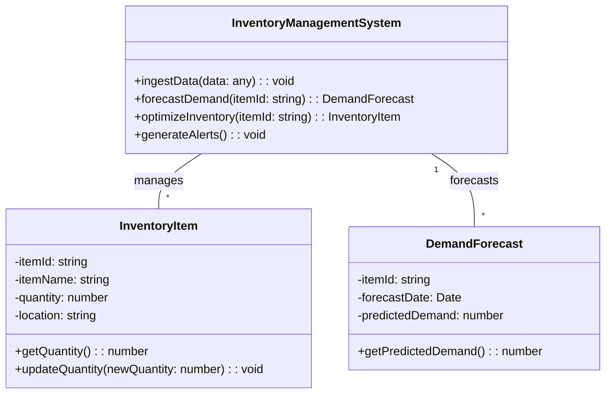

```markdown
# SmartInventory Design

## 📋 Objectifs et Vision

### Objectifs Principaux
Le projet SmartInventory vise à créer un système de gestion d'inventaire intelligent qui optimise les niveaux de stock, prédit les besoins futurs et s'intègre de manière transparente avec les fournisseurs. L'objectif est de réduire les coûts, minimiser les ruptures de stock et améliorer l'efficacité globale de la chaîne d'approvisionnement.

### Buts du Système
- Suivre l'inventaire en temps réel à travers différents emplacements.
- Prédire la demande future en utilisant des algorithmes d'IA.
- Optimiser les niveaux de stock pour minimiser les coûts de stockage et les pertes.
- Générer des alertes automatiques pour les niveaux de stock bas et les anomalies.
- Faciliter l'intégration avec les systèmes des fournisseurs pour une réapprovisionnement automatisé.

### Métriques de Succès
- Réduction des coûts de stockage de X%.
- Diminution des ruptures de stock de Y%.
- Amélioration de la précision des prévisions de la demande de Z%.
- Augmentation de l'efficacité du processus de réapprovisionnement de W%.
- Temps de réponse aux alertes inférieur à T minutes.

## 🏗️ Architecture des Données

### Structures de Données Principales

#### InventoryItem
```typescript
interface InventoryItem {
  itemId: string;
  itemName: string;
  description: string;
  quantity: number;
  location: string;
  unitCost: number;
  reorderPoint: number;
  reorderQuantity: number;
  supplierId: string;
  lastUpdated: Date;
}
```

#### DemandForecast
```typescript
interface DemandForecast {
  itemId: string;
  forecastDate: Date;
  predictedDemand: number;
  confidenceLevel: number;
}
```

## 🏗️ Architecture des Nœuds PocketFlow

### Modèle de Nœud Standard
```typescript
abstract class BaseNode {
  // Configuration et état du nœud
  
  /**
   * Phase 1: Préparation - Lecture et prétraitement des données
   */
  protected abstract prep(shared: SharedStore): any;

  /**
   * Phase 2: Exécution - Logique principale
   */
  protected abstract async exec(prepResult: any): Promise<any>;

  /**
   * Phase 3: Post-traitement - Écriture des résultats
   */
  protected abstract post(shared: SharedStore, prepResult: any, execResult: any): string;
}
```

### Implémentation des Nœuds Principaux

#### DataIngestionNode
- **Rôle**: Collecte et normalise les données d'inventaire provenant de diverses sources (bases de données, fichiers CSV, API).
- **Fonctionnalités clés**:
  - Extraction des données d'inventaire.
  - Transformation des données dans un format standard.
  - Validation des données pour assurer la qualité.

#### DemandForecastingNode
- **Rôle**: Prédit la demande future pour chaque article d'inventaire en utilisant des algorithmes d'apprentissage automatique.
- **Fonctionnalités clés**:
  - Entraînement des modèles de prédiction de la demande.
  - Génération de prévisions de la demande basées sur les données historiques.
  - Évaluation de la précision des prévisions.

#### InventoryOptimizationNode
- **Rôle**: Optimise les niveaux de stock en fonction des prévisions de la demande, des coûts de stockage et des délais de livraison.
- **Fonctionnalités clés**:
  - Calcul des niveaux de stock optimaux.
  - Génération de recommandations de réapprovisionnement.
  - Analyse de scénarios pour évaluer l'impact des différentes stratégies d'inventaire.

#### AlertingNode
- **Rôle**: Génère des alertes automatiques pour les niveaux de stock bas, les anomalies et les problèmes potentiels.
- **Fonctionnalités clés**:
  - Surveillance des niveaux de stock en temps réel.
  - Détection des anomalies dans les données d'inventaire.
  - Envoi d'alertes par e-mail, SMS ou via l'interface utilisateur.

## 🔄 PocketFlow Architecture - 4 Stages

```mermaid
flowchart TD
    start[Start] --> stage1[Data Ingestion]
    stage1 --> stage2[Demand Forecasting]
    stage2 --> stage3[Inventory Optimization]
    stage3 --> stage4[Alerting]
    stage4 --> end[End]
    
    subgraph external[External Services]
        supplierAPI[Supplier API]
        database[Inventory Database]
    end
    
    stage3 -.-> supplierAPI
    stage1 -.-> database
```

### Détail des Stages

#### 1. Data Ingestion
- **Objectif** : Collecter et préparer les données d'inventaire pour l'analyse.
- **Entrée** : Données d'inventaire provenant de diverses sources (bases de données, fichiers CSV, API).
- **Traitement** : 
  - Extraction des données.
  - Transformation des données dans un format standard.
  - Validation des données.
- **Sortie** : Données d'inventaire normalisées.

#### 2. Demand Forecasting
- **Objectif** : Prédire la demande future pour chaque article d'inventaire.
- **Entrée** : Données d'inventaire historiques, données de ventes, données promotionnelles.
- **Traitement** : 
  - Sélection des algorithmes de prédiction appropriés (ex: ARIMA, Prophet, réseaux de neurones).
  - Entraînement des modèles de prédiction.
  - Génération de prévisions de la demande.
- **Sortie** : Prévisions de la demande pour chaque article d'inventaire.

#### 3. Inventory Optimization
- **Objectif** : Optimiser les niveaux de stock pour minimiser les coûts et maximiser la disponibilité.
- **Entrée** : Prévisions de la demande, coûts de stockage, délais de livraison, coûts de commande.
- **Traitement** : 
  - Calcul des niveaux de stock optimaux (ex: quantité économique de commande, point de commande).
  - Génération de recommandations de réapprovisionnement.
  - Analyse de scénarios.
- **Sortie** : Recommandations de réapprovisionnement et niveaux de stock optimaux.

#### 4. Alerting
- **Objectif** : Générer des alertes automatiques pour les problèmes potentiels.
- **Entrée** : Niveaux de stock actuels, prévisions de la demande, recommandations de réapprovisionnement.
- **Traitement** : 
  - Surveillance des niveaux de stock.
  - Détection des anomalies.
  - Génération d'alertes.
- **Sortie** : Alertes envoyées aux utilisateurs concernés.

## 🔄 Flux de Données

### Composant Central
```typescript
interface InventoryManagementSystem {
  ingestData(data: any): void;
  forecastDemand(itemId: string): DemandForecast;
  optimizeInventory(itemId: string): InventoryItem;
  generateAlerts(): void;
}
```

### Flux de Données Entre Nœuds
1. **DataIngestionNode** → **DemandForecastingNode**:
   - Les données d'inventaire normalisées sont transmises au DemandForecastingNode pour la prédiction de la demande.

2. **DemandForecastingNode** → **InventoryOptimizationNode**:
   - Les prévisions de la demande sont transmises à l'InventoryOptimizationNode pour le calcul des niveaux de stock optimaux.

3. **InventoryOptimizationNode** → **AlertingNode**:
   - Les niveaux de stock optimaux et les recommandations de réapprovisionnement sont transmis à l'AlertingNode pour la surveillance et la génération d'alertes.

## 🔌 Intégration avec les Services Externes

### Supplier API
```typescript
// Exemple d'intégration avec Supplier API
async function placeOrder(supplierId: string, itemId: string, quantity: number): Promise<string> {
  // Implémentation de l'appel à l'API du fournisseur pour passer une commande
  // Retourne un ID de confirmation de commande
}
```

### Inventory Database
```typescript
// Exemple d'intégration avec Inventory Database
async function updateInventory(itemId: string, quantity: number): Promise<boolean> {
  // Implémentation de la mise à jour de la quantité d'un article dans la base de données
  // Retourne true si la mise à jour a réussi, false sinon
}
```

## 📊 Diagramme de Classes



## 🛡️ Mécanismes de Résilience

### Redondance des données
```typescript
// Exemple de code pour la redondance des données
function backupData(data: any): void {
  // Implémentation de la sauvegarde des données dans un emplacement secondaire
}
```

### Gestion des erreurs
```typescript
// Exemple de code pour la gestion des erreurs
try {
  // Code susceptible de générer une erreur
} catch (error) {
  // Gestion de l'erreur
  console.error("Erreur:", error);
}
```

## 🚀 Plan d'Implémentation Technique Détaillé

### Phase 1: Infrastructure et Acquisition de Données (4 semaines)
1. **Mise en place de l'infrastructure cloud**
   - Création des instances de serveurs (bases de données, serveurs d'application).
   - Configuration du réseau et de la sécurité.
   - Déploiement des outils de monitoring.

2. **Implémentation du DataIngestionNode**
   - Développement des connecteurs pour les différentes sources de données.
   - Implémentation de la logique de transformation et de validation des données.
   - Tests unitaires et d'intégration.

### Phase 2: Prédiction de la Demande et Optimisation (6 semaines)
1. **Implémentation du DemandForecastingNode**
   - Sélection et configuration des algorithmes de prédiction.
   - Entraînement des modèles de prédiction.
   - Évaluation de la précision des prévisions.

2. **Implémentation du InventoryOptimizationNode**
   - Développement de la logique de calcul des niveaux de stock optimaux.
   - Implémentation des recommandations de réapprovisionnement.
   - Tests et validation des résultats.

### Phase 3: Alerting et Intégration (4 semaines)
1. **Implémentation du AlertingNode**
   - Développement de la logique de surveillance des niveaux de stock.
   - Implémentation de la détection des anomalies.
   - Configuration des alertes et des notifications.

2. **Intégration avec les services externes**
   - Développement des API pour l'intégration avec les fournisseurs.
   - Tests d'intégration.

## 📊 Métriques et Monitoring

### KPIs Techniques
- **Temps de réponse des API** : Mesure le temps nécessaire pour répondre aux requêtes API.
- **Taux d'erreur** : Mesure le pourcentage de requêtes qui échouent.
- **Utilisation des ressources** : Mesure l'utilisation du CPU, de la mémoire et du disque.
- **Latence de la base de données** : Mesure le temps nécessaire pour exécuter les requêtes de la base de données.

### KPIs Business
- **Taux de rotation des stocks** : Mesure la vitesse à laquelle les stocks sont vendus et remplacés.
- **Niveau de service** : Mesure le pourcentage de commandes qui sont livrées à temps et en totalité.
- **Coût de stockage** : Mesure le coût total du stockage des stocks.
- **Ruptures de stock** : Mesure le nombre de fois où un article est en rupture de stock.

## 🎯 Objectifs de Performance

### Targets à Court Terme (3 mois)
- Réduire les ruptures de stock de 10%.
- Améliorer la précision des prévisions de la demande de 5%.
- Réduire les coûts de stockage de 5%.
- Automatiser 50% des commandes de réapprovisionnement.

### Targets à Long Terme (12 mois)
- Réduire les ruptures de stock de 25%.
- Améliorer la précision des prévisions de la demande de 15%.
- Réduire les coûts de stockage de 15%.
- Automatiser 90% des commandes de réapprovisionnement.

## 🔍 Conclusion

SmartInventory est un système de gestion d'inventaire intelligent qui utilise l'IA pour optimiser les stocks et prédire les besoins. L'architecture PocketFlow permet une modularité et une évolutivité importantes. Les prochaines étapes consistent à implémenter les différents nœuds et à intégrer le système avec les services externes. Un monitoring continu des KPIs techniques et business permettra d'assurer la performance et l'efficacité du système.

---

Ce document de design a été généré automatiquement par Design Doc Automator basé sur le framework PocketFlow.
```