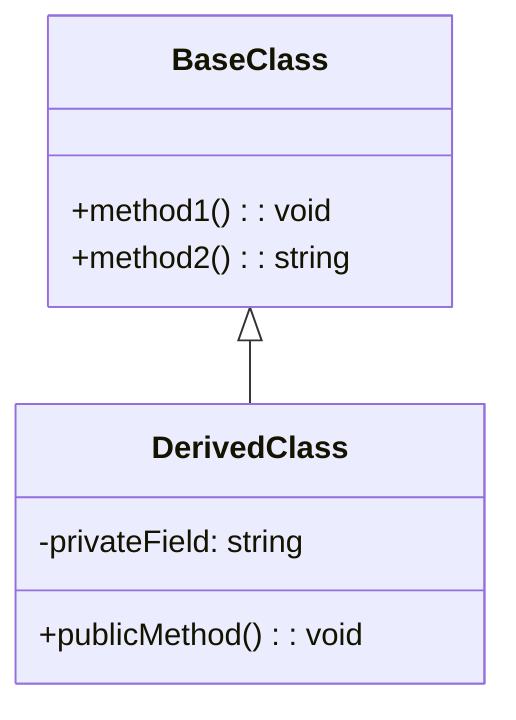

# {{PROJECT_NAME}} Design

## 📋 Objectifs et Vision

### Objectifs Principaux
[Description des objectifs principaux du projet]

### Buts du Système
- [But 1]
- [But 2]
- [But 3]
- [But 4]
- [But 5]

### Métriques de Succès
- [Métrique 1]
- [Métrique 2]
- [Métrique 3]
- [Métrique 4]
- [Métrique 5]

## 🏗️ Architecture des Données

### Structures de Données Principales

#### [Structure 1]
```typescript
interface [NomStructure] {
  // Propriétés et types
}
```

#### [Structure 2]
```typescript
interface [NomStructure] {
  // Propriétés et types
}
```

## 🏗️ Architecture des Nœuds PocketFlow

### Modèle de Nœud Standard
```typescript
abstract class BaseNode {
  // Configuration et état du nœud
  
  /**
   * Phase 1: Préparation - Lecture et prétraitement des données
   */
  protected abstract prep(shared: SharedStore): any;

  /**
   * Phase 2: Exécution - Logique principale
   */
  protected abstract async exec(prepResult: any): Promise<any>;

  /**
   * Phase 3: Post-traitement - Écriture des résultats
   */
  protected abstract post(shared: SharedStore, prepResult: any, execResult: any): string;
}
```

### Implémentation des Nœuds Principaux

#### [Nœud 1]
- **Rôle**: [Description du rôle]
- **Fonctionnalités clés**:
  - [Fonctionnalité 1]
  - [Fonctionnalité 2]
  - [Fonctionnalité 3]

#### [Nœud 2]
- **Rôle**: [Description du rôle]
- **Fonctionnalités clés**:
  - [Fonctionnalité 1]
  - [Fonctionnalité 2]
  - [Fonctionnalité 3]

## 🔄 PocketFlow Architecture - [N] Stages

```mermaid
flowchart TD
    start[Start] --> stage1[Stage 1]
    stage1 --> stage2[Stage 2]
    stage2 --> stage3[Stage 3]
    stage3 --> end[End]
    
    subgraph external[External Services]
        service1[Service 1]
        service2[Service 2]
    end
    
    stage2 -.-> service1
    stage3 -.-> service2
```

### Détail des Stages

#### 1. [Stage 1]
- **Objectif** : [Description de l'objectif]
- **Entrée** : [Description des entrées]
- **Traitement** : 
  - [Étape 1]
  - [Étape 2]
  - [Étape 3]
- **Sortie** : [Description des sorties]

#### 2. [Stage 2]
- **Objectif** : [Description de l'objectif]
- **Entrée** : [Description des entrées]
- **Traitement** : 
  - [Étape 1]
  - [Étape 2]
  - [Étape 3]
- **Sortie** : [Description des sorties]

## 🔄 Flux de Données

### [Composant Central]
```typescript
interface [NomComposant] {
  // Méthodes et propriétés
}
```

### Flux de Données Entre Nœuds
1. **[Nœud A]** → **[Nœud B]** → **[Nœud C]**:
   - [Description du flux de données]

2. **[Nœud X]** → **[Nœud Y]** → **[Nœud Z]**:
   - [Description du flux de données]

## 🔌 Intégration avec les Services Externes

### [Service 1]
```typescript
// Exemple d'intégration avec [Service 1]
function [nomFonction](param: string): Promise<string> {
  // Implémentation
}
```

### [Service 2]
```typescript
// Exemple d'intégration avec [Service 2]
async function [nomFonction](param: string): Promise<any> {
  // Implémentation
}
```

## 📊 Diagramme de Classes



## 🛡️ Mécanismes de Résilience

### [Mécanisme 1]
```typescript
// Exemple de code pour [Mécanisme 1]
```

### [Mécanisme 2]
```typescript
// Exemple de code pour [Mécanisme 2]
```

## 🚀 Plan d'Implémentation Technique Détaillé

### Phase 1: [Nom de la Phase] ([Durée])
1. **[Tâche 1]**
   - [Sous-tâche A]
   - [Sous-tâche B]
   - [Sous-tâche C]

2. **[Tâche 2]**
   - [Sous-tâche A]
   - [Sous-tâche B]
   - [Sous-tâche C]

### Phase 2: [Nom de la Phase] ([Durée])
1. **[Tâche 1]**
   - [Sous-tâche A]
   - [Sous-tâche B]
   - [Sous-tâche C]

## 📊 Métriques et Monitoring

### KPIs Techniques
- **[KPI 1]** : [Description]
- **[KPI 2]** : [Description]
- **[KPI 3]** : [Description]
- **[KPI 4]** : [Description]

### KPIs Business
- **[KPI 1]** : [Description]
- **[KPI 2]** : [Description]
- **[KPI 3]** : [Description]
- **[KPI 4]** : [Description]

## 🎯 Objectifs de Performance

### Targets à Court Terme ([Période])
- **[Target 1]**
- **[Target 2]**
- **[Target 3]**
- **[Target 4]**

### Targets à Long Terme ([Période])
- **[Target 1]**
- **[Target 2]**
- **[Target 3]**
- **[Target 4]**

## 🔍 Conclusion

[Résumé des points clés de l'architecture et des prochaines étapes]

---

Ce document de design a été généré automatiquement par Design Doc Automator basé sur le framework PocketFlow.